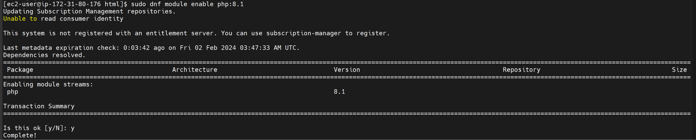

"# Implementing-Word-press-website-with-LVM-Storage-management" 

####  Web Solution Implementation with WordPress

Embark on a journey to develop practical skills in deploying web solutions, with a focus on WordPress, the leading PHP-based content management system. This project is an essential milestone for aspiring DevOps engineers, offering hands-on experience with storage infrastructure setup on Linux servers and WordPress deployment.

##  Project Overview:
1.  ####  Storage Subsystem Configuration:

*   Objective: Gain practical knowledge in managing disks, partitions, and volumes on Linux-based Web and Database servers.
*   Tasks:
    *   Initialize and format disks.
    *   Create and manage partitions.
    *   Implement Logical Volume Management (LVM) for flexible storage.
2.  ####    WordPress Installation and Database Connectivity:

*   Objective: Enhance your proficiency in deploying web solutions by setting up WordPress and linking it with a remote MySQL or MariaDB database server.
*   Tasks:
    *   Install necessary PHP, Apache/Nginx, and MySQL packages.
    *   Configure WordPress and set up its connection to a remote database.
    *   Apply security best practices for WordPress and database interactions.
##  Skills and Competencies:
*   **Linux Storage Management**: Understand and manipulate the Linux storage stack, from physical disks to file systems, ensuring optimal setup for web and database servers.
*   **WordPress Deployment**: Master the process of installing and configuring WordPress, customizing it to meet specific project requirements.
*   **Database Connectivity**: Establish secure and efficient connections between WordPress and remote database servers, ensuring data integrity and performance.
*   **Troubleshooting**: Develop a keen eye for diagnosing and resolving common issues related to web solutions, from server configuration to application deployment.

### Project Outcomes:
By completing this project, you will solidify your foundation in web solution implementation, particularly with WordPress, and enhance your ability to manage complex storage configurations on Linux servers. Your deepened understanding of core web solution components and troubleshooting skills will be invaluable in your growth and development as a DevOps engineer.

Embark on this project to harness the power of WordPress and Linux, and take a significant step forward in your DevOps journey.

## Understanding 3 Tier Architecture

The Three-tier Architecture is a prevalent client-server software design pattern that organizes applications into three distinct layers:

1.  **Presentation Layer (Client Tier)**: This is the user interface of the application, where users interact with the software. It's responsible for presenting data to users and interpreting user commands.

2.  **Application Layer (Business Logic/Logic Tier)**: This layer processes user requests, makes logical decisions, performs calculations, and moves data between the presentation and database layers.

3.  **Data Layer (Database Tier)**: This tier consists of database servers where information is stored and retrieved. It ensures data integrity and security.


In this project, you will have the hands-on experience that showcases Three-tier Architecture while also ensuring that the disks used to store files on the Linux servers are adequately partitioned and managed through programs such as
and LVM respectively.

You will be working with several storage and disk management concepts, to have a better understanding, watch following video: Disk management in Linux
Note: We are gradually introducing new AWS elements into our solutions, but do not be worried if you do not fully understand AWS Cloud Services yet, there are Cloud focused projects ahead where we wil I get into deep details of various Cloud concepts and technologies - not only AWS, but other Cloud Service Providers as well.
Your 3-Tier Setup
1.	A Laptop or PC to serve as a client
2.	An EC2 Linux Server as a web server (This is where you will install Wordpress)
3.	An EC2 Linux server as a database (DB) server

Use *RedHat* OS for this project

By now you should know how to spin up an EC2 instanse on AWS, but if you forgot - refer to Project1Step 0. In previous projects we used 'Ubuntu', but it is better to be well-versed with various Linux distributions, thus, for this projects we will use very popular distribution called 'RedHat' (it also has a fully compatible derivative - CentOS)
Note: for Ubuntu server, when connecting to it via SSH/Putty or any other tool, we used  ubuntu  user, but for RedHat you will need to use ec2-user user. Connection string will look like ec2-user@<Public-IP>


## Implementing LVM on Linux servers (Web and Database servers)
### Prepare a Web Server
Launch an EC2 instance that will serve as "Web Server". Create 3 volumes in the same AZ as your Web Server EC2, each of 10 GiB.


Step 1: Create a New EBS Volume
Log in to AWS Management Console.
Navigate to the EC2 Dashboard.
In the Elastic Block Store section, select Volumes.
Click Create Volume.
Choose the volume type and specify the size and other options as required.
Select the same Availability Zone as your EC2 instance to attach the volume to.
Click Create.

Step 2: Attach the EBS Volume to an EC2 Instance
Once the volume is created, select it in the Volumes pane.
Click Actions, then select Attach Volume.
In the Attach Volume dialog, specify the EC2 instance by typing its instance ID or by selecting it from the list.
Assign a device name (e.g., /dev/sdh). AWS will provide a recommended name.
Click Attach.

2.  Open up the Linux terminal to begin configuration


3.  Use lsblk command to inspect what block devices are attached to the server. Notice names of your newly created devices. All devices in Linux reside in /dev/ directory. Inspect it with ls /dev/ and make sure you see all 3 newly created block devices there - their names will likely be xvdf, xvdh, xvdg.

3.  Use df -h command to see all mounts and free space on your server


4.  Use df -h command to see all mounts and free space on your server

5.  Use gdisk utility to create a single partition on each of the 3 disks

```markdown
sudo gdisk /dev/xvdf
```

```bash
Command (? for help): n
Partition number (1-128, default 1): 1
First sector (34-20971486, default = 2048) or {+-}size{KMGTP}:
Last sector (2048-20971486, default = 20971486) or {+-}size{KMGTP}:
Current type is 8300 (Linux filesystem)
Hex code or GUID (L to show codes, Enter = 8300): 8e00
Changed type of partition to 'Linux LVM'

Command (? for help): p
Disk /dev/xvdf: 20971520 sectors, 10.0 GiB
Sector size (logical/physical): 512/512 bytes
Disk identifier (GUID): 61C4E989-A54A-42B5-A99D-02789DB9D6DA
Partition table holds up to 128 entries
Main partition table begins at sector 2 and ends at sector 33
First usable sector is 34, last usable sector is 20971486
Partitions will be aligned on 2048-sector boundaries
Total free space is 2014 sectors (1007.0 KiB)

Number  Start (sector)    End (sector)  Size       Code  Name
   1            2048        20971486   10.0 GiB    8E00  Linux LVM

Command (? for help): w

Final checks complete. About to write GPT data. THIS WILL OVERWRITE EXISTING
PARTITIONS!!

Do you want to proceed? (Y/N): y
OK; writing new GUID partition table (GPT) to /dev/xvdf.
The operation has completed successfully.
```

Do same for xvdg and xvdh

Use lsblk utility to view the newly configured partition on each of the 3 disks. the result should show as below

```console
[ec2-user@ip-172-31-29-146 ~]$ lsblk
NAME    MAJ:MIN RM  SIZE RO TYPE MOUNTPOINTS
xvda    202:0    0   10G  0 disk
├─xvda1 202:1    0    1M  0 part
├─xvda2 202:2    0  200M  0 part /boot/efi
├─xvda3 202:3    0  600M  0 part /boot
└─xvda4 202:4    0  9.2G  0 part /
xvdf    202:80   0   10G  0 disk
└─xvdf1 202:81   0   10G  0 part
xvdg    202:96   0   10G  0 disk
└─xvdg1 202:97   0   10G  0 part
xvdh    202:112  0   10G  0 disk
└─xvdh1 202:113  0   10G  0 part
```
6.  Install lvm2 package using sudo yum install lvm2. Run sudo lvmdiskscan command to check for available partitions.


```markdown
sudo yum install lvm2
```


Note: Previously, in Ubuntu we used apt command to install packages, in RedHat/CentOS a different package manager is used, so we shall use yum command instead.

7.  Use pvcreate utility to mark each of 3 disks as physical volumes (PVs) to be used by LVM

```markdown
sudo pvcreate /dev/xvdf1
sudo pvcreate /dev/xvdg1
sudo pvcreate /dev/xvdh1
```

8.  Verify that your Physical volume has been created successfully by running 

```markdown
sudo pvs
```


9.  Use vgcreate utility to add all 3 PVs to a volume group (VG). Name the VG webdata-vg

```bash
sudo vgcreate webdata-vg /dev/xvdh1 /dev/xvdg1 /dev/xvdf1
```
10. Verify that your VG has been created successfully by running ```markdown
sudo vgs
```

11. Use lvcreate utility to create 2 logical volumes.  apps-lv (Use half of the PV size), and logs-lv Use the remaining space of the PV size. NOTE: apps-lv will be used to store data for the Website while, logs-lv will be used to store data for logs.

```bash
sudo lvcreate -n apps-lv -L 14G webdata-vg
sudo lvcreate -n logs-lv -L 14G webdata-vg
```

12. Verify that your Logical Volume has been created successfully by running 

```markdown
sudo lvs
```

13. view the entire setup
```markdown
sudo vgdisplay -v #view complete setup - VG, PV, and LV
sudo lsblk 
```

```bash
[ec2-user@ip-1~]$ sudo vgdisplay -v
  --- Volume group ---
  VG Name               webdata-vg
  System ID
  Format                lvm2
  Metadata Areas        3
  Metadata Sequence No  3
  VG Access             read/write
  VG Status             resizable
  MAX LV                0
  Cur LV                2
  Open LV               0
  Max PV                0
  Cur PV                3
  Act PV                3
  VG Size               <29.99 GiB
  PE Size               4.00 MiB
  Total PE              7677
  Alloc PE / Size       7168 / 28.00 GiB
  Free  PE / Size       509 / <1.99 GiB
  VG UUID               9HEH9i-wjPQ-xZ6T-bsHx-4fw0-71v6-xbqTvb

  --- Logical volume ---
  LV Path                /dev/webdata-vg/apps-lv
  LV Name                apps-lv
  VG Name                webdata-vg
  LV UUID                nOh5nJ-XPBP-Gkpv-XKQ1-LE5v-oAep-LD1dsJ
  LV Write Access        read/write
  LV Creation host, time ip-172-31-29-146.ec2.internal, 2024-01-12 02:29:37 +0000
  LV Status              available
  # open                 0
  LV Size                14.00 GiB
  Current LE             3584
  Segments               2
  Allocation             inherit
  Read ahead sectors     auto
  - currently set to     8192
  Block device           253:0

  --- Logical volume ---
  LV Path                /dev/webdata-vg/logs-lv
  LV Name                logs-lv
  VG Name                webdata-vg
  LV UUID                8BKKOn-tG03-ZXbb-fseu-Qr1n-yLFk-2ZCynp
  LV Write Access        read/write
  LV Creation host, time ip-172-31-29-146.ec2.internal, 2024-01-12 02:29:37 +0000
  LV Status              available
  # open                 0
  LV Size                14.00 GiB
  Current LE             3584
  Segments               2
  Allocation             inherit
  Read ahead sectors     auto
  - currently set to     8192
  Block device           253:1

  --- Physical volumes ---
  PV Name               /dev/xvdh1
  PV UUID               eyrNbT-qHl0-mBuy-zxXh-amIa-uKo9-tzcGri
  PV Status             allocatable
  Total PE / Free PE    2559 / 0

  PV Name               /dev/xvdg1
  PV UUID               EYrBbL-P7sX-f6Vu-BGN5-Jxg9-MPOw-IJONlh
  PV Status             allocatable
  Total PE / Free PE    2559 / 509

  PV Name               /dev/xvdf1
  PV UUID               erDakY-kM7o-ttvr-kzwt-c0dS-2tno-Ef1bT8
  PV Status             allocatable
  Total PE / Free PE    2559 / 0
```


14. Use mkfs.ext4 to format the logical volumes with ext4 filesystem

```markdown
sudo mkfs -t ext4 /dev/webdata-vg/apps-lv
sudo mkfs -t ext4 /dev/webdata-vg/logs-lv
```

15. Create **/var/www/html** directory to store website files

```markdown
sudo mkdir -p /var/www/html
```
16. Create /home/recovery/logs to store backup of log data

```markdown
sudo mkdir -p /home/recovery/logs
```

17. Mount /var/www/html on apps-lv logical volume

```markdown
sudo mount /dev/webdata-vg/apps-lv /var/www/html/
```
18. Use rsync utility to backup all the files in the log directory /var/log into /home/recovery/logs (This is required before mounting the file system)

```markdown
sudo rsync -av /var/log/. /home/recovery/logs/
```


19. Mount /var/log on logs-lv logical volume. (Note that all the existing data on /var/log will be deleted. That is why step 18 above is very
important)

```markdown
sudo mount /dev/webdata-vg/logs-lv /var/log
```
20. Restore log files back into /var/log directory

```markdown
sudo rsync -av /home/recovery/logs/ /var/log
```

21. Update /etc/fstab file so that the mount configuration will persist after restart of the server.

The UUID of the  device will be used to update the /etc/fstab file;

```markdown
sudo blkid
```


sudo vi /etc/fstab
Update /etc/fstab in this format using your own UUID and rememeber to remove the leading and ending quotes.


22. Test the configuration and reload the daemon

```markdown
sudo mount -a
sudo systemctl daemon-reload
```

23. Verify your setup by running df -h, output must look like this:


### — Prepare the Database Server
Launch a second RedHat EC2 instance that will have a role - 'DB Server'
Repeat the same steps as for the Web Server, but instead of apps-lv create db-lv and mount it to /db directory instead of /var/www/html/.

Create 3 volumes in same regions to be attached to the database server


ls /dev/


sudo gdisk /dev/xvdf


Install LVM


## Step 3 — Install Wordpress on your Web Server EC2


1.  Update the repository
    sudo yum -y update
2.  Install wget, Apache and it's dependencies
```markdown
sudo yum -y install wget httpd php php-mysqlnd php-fpm php-json
```
3.  Start Apache

```markdown
sudo systemctl start httpd

sudo systemctl enable httpd
```
4.  To install PHP and it's dependencies

First, install the EPEL repository.
sudo dnf install https://dl.fedoraproject.org/pub/epel/epel-release-latest-8.noarch.rpm

Next, install yum utils and enable remi-repository using the command below.

`sudo dnf install dnf-utils http://rpms.remirepo.net/enterprise/remi-release-8.rpm`

After the successful installation of yum-utils and Remi-packages, search for the PHP modules which are available for download by running the command.

`sudo dnf module list php`

The output will include the available PHP modules, stream and installation profiles as shown below.


To install the newer release, PHP 8.1, reset the PHP modules
```markdown
sudo dnf module reset php
```
Having reset the PHP modules, enable the PHP 8.1 module by running.

```markdown
sudo dnf module enable php:8.1
```


Finally, install PHP, PHP-FPM (FastCGI Process Manager) and associated PHP modules using the command.
```markdown
sudo dnf install php php-opcache php-gd php-curl php-mysqlnd
```
To verify the version installed to run.
```markdown
php -v 
```

`[ec2-user@ip-172-31-80-176 html]$ php -v
PHP 8.1.27 (cli) (built: Dec 19 2023 20:35:55) (NTS gcc x86_64)
Copyright (c) The PHP Group
Zend Engine v4.1.27, Copyright (c) Zend Technologies
    with Zend OPcache v8.1.27, Copyright (c), by Zend Technologies
[ec2-user@ip-172-31-80-176 html]$ sudo systemctl status php-fpm
○ php-fpm.service - The PHP FastCGI Process Manager
     Loaded: loaded (/usr/lib/systemd/system/php-fpm.service; disabled; preset: disabled)
     Active: inactive (dead)`


sudo systemctl start php-fpm
sudo systemctl enable php-fpm
sudo setsebool -P httpd_execmem 1


```bash
sudo yum -y update
sudo yum -y install wget httpd php php-mysqlnd php-fpm php-json
cd /var/www/html
sudo wget http://wordpress.org/latest.tar.gz
sudo tar xzvf latest.tar.gz
cp -r wordpress/* /var/www/html
sudo systemctl enable httpd`
```


5.  Restart Apache
```markdown
sudo systemctl restart httpd
```


6.  Download wordpress and copy wordpress to var/www/html

```bash
mkdir wordpress
cd   wordpress
sudo wget http://wordpress.org/latest.tar.gz
sudo tar xzvf latest.tar.gz
sudo rm -rf latest.tar.gz
cp wordpress/wp-config-sample.php wordpress/wp-config.php
cp -R . /var/www/html/
```
7.  Configure Selinux Policies

 ```bash
 sudo chown -R apache:apache /var/www/html/wordpress
 sudo chcon -t httpd_sys_rw_content_t /var/www/html/wordpress -R
 sudo setsebool -P httpd_can_network_connect=1
 ```

Step 4 — Install MySQL on your DB Server EC2

```markdown
sudo yum update
sudo yum install mysql-server
```

Verify that the service is up and running by using sudo systemctl status mysqld, if it is not running, restart the service and enable it so it will be running even after reboot:

```markdown
sudo systemctl restart mysqld
sudo systemctl enable mysqld
```

Step 5 — Configure DB to work with WordPress

```markdown
sudo mysql
CREATE DATABASE wordpress;
CREATE USER `lourash`@`<Web-Server-Private-IP-Address>` IDENTIFIED BY 'mypass';
GRANT ALL ON wordpress.* TO 'lourash'@'<Web-Server-Private-IP-Address>';
FLUSH PRIVILEGES;
SHOW DATABASES;
exit
```


Step 6 — Configure WordPress to connect to remote database.
Hint: Do not forget to open MySQL port 3306 on DB Server EC2. For extra security, you shall allow access to the DB server ONLY from your Web Server's IP address, so in the Inbound Rule configuration specify source as /32

1.  Install MySQL client and test that you can connect from your Web Server to your DB server by using mysql-client

edit the wp-config.php file using, update the database name, password and host details  

```markdown
sudo vi wp-config.php
```


restart apache services 

Disabling Apache Welcome Page
```markdown
sudo mv /etc/httpd/conf.d/welcome.conf /etc/httpd/conf.d/welcome.conf_backup
```

2.	Verify if you can successfully execute	command and see a list of existing databases.

3.	Change permissions and configuration so Apache could use WordPress:

4.		Enable TCP port 80 in Inbound Rules configuration for your Web Server EC2 (enable from everywhere 0.0.0.0/0 or from your workstation's IP)
5.	Try to access from your browser the link to your WordPress


